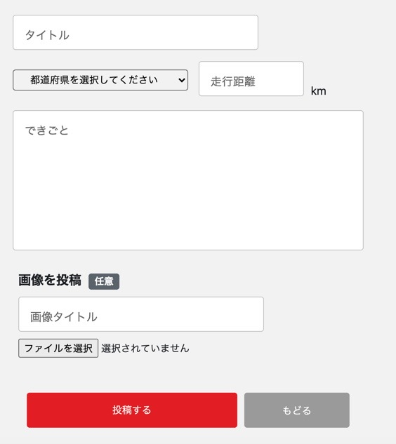

## アプリケーション名
CYCLE NOTE

## アプリケーション概要
サイクルスポットを共有できるアプリ 
アプリ機能は以下の通り 
#### 1. 記事の投稿
タイトル、都道府県、走行距離、できごと、画像タイトル(任意)、画像(任意)を入力することで、記事の投稿が出来る 

#### 2. 記事の表示
投稿した記事は、トップページに表示される 
#### 3. いいね機能
投稿された記事に対して、いいねを押すことが出来る 
#### 4. 記事の検索
投稿された記事を、キーワード・走行距離・都道府県の項目で検索出来る 

## 開発環境
・HTML&CSS
・Ruby
・Ruby on rails
・JavaScript
・Bootstrap 
・EC2
・S3
・VSコード(Visual Studio Code)

## URL
http://18.177.112.110/

## 制作背景
趣味のサイクリングに関して、インターネット上にサイクルスポット情報が少なかった 
一方、友達からの口コミで目的地を決める経験がしばしばあった 
以上の経験から、誰でも気軽にサイクリングの経験を共有しあえるサービスはないかと考え、本アプリを考案 
#### 目的のターゲット層
サイクリングが趣味の人
#### どんなニーズ&課題に
・他の人のサイクリングの経験を知りたい 
・サイクルスポットの情報が知りたい 
・おおよそのサイクリング距離が知りたい

## ログイン方法
ヘッダー右側のゲストログインボタンを押すと、ゲストユーザーでログインできる

## 実装機能
### ユーザー管理機能（新規登録・ログイン）
### 記事投稿機能
### 記事一覧表示機能
### マイページ記事一覧表示機能
### ユーザー登録情報編集機能
### 記事詳細表示機能
### 記事編集・削除機能
### 画像投稿機能
### 記事検索機能
### いいね機能
### ゲストログイン機能
### ページネーション機能
### レスポンシブデザイン

## DB設計
### ER図

## 工夫したポイント

## 課題や今後実装したい機能