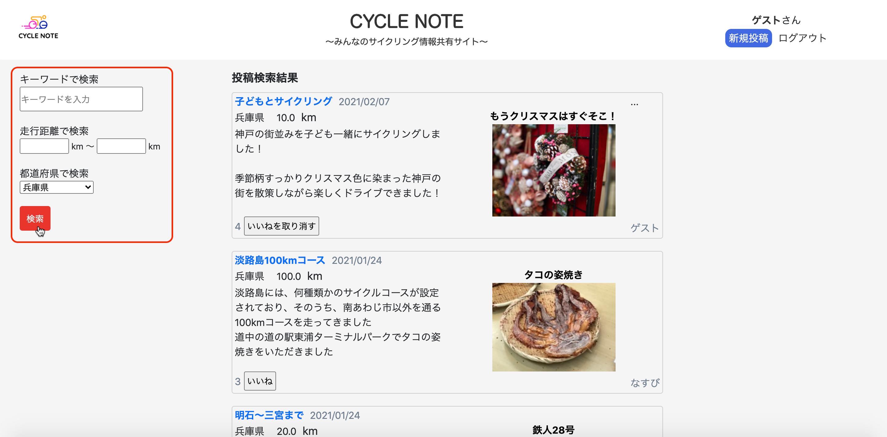
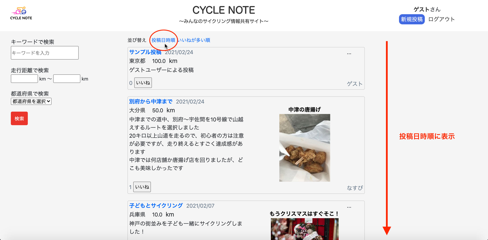
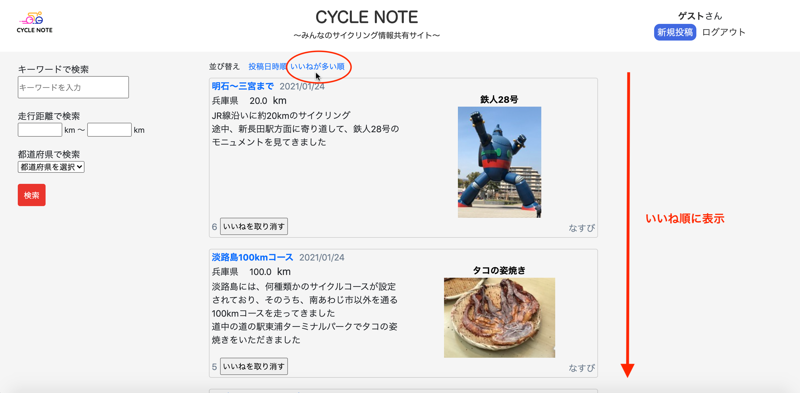

## アプリケーション名
#### CYCLE NOTE

## 開発環境
HTML&CSS / Ruby / Ruby on Rails / JavaScript / Bootstrap / 
MySQL / EC2 / S3 / Visual Studio Code

## URL
http://18.177.112.110/

## ログイン方法
ヘッダー右側のゲストログインボタンから、ゲストユーザーでログイン可能

## アプリケーション概要
サイクリングの体験を共有できるアプリ 
アプリの主要機能は以下の通り 
#### 1. 記事の投稿
ヘッダーの新規投稿ボタンから記事投稿画面に移動 
タイトル、都道府県、走行距離、できごと、画像タイトル(任意)、画像(任意)を入力することで、記事の投稿が出来る 
  
#### 2. 記事の表示
投稿した記事は、トップページに表示される 

#### 3. いいね機能
投稿された記事に対して、いいねを押すことが出来る 

#### 4. 記事の検索
投稿された記事を、キーワード・走行距離・都道府県の項目で検索出来る 

#### 5. 記事へのコメント
記事詳細ページから記事へのコメントができる 
  

## 制作背景
自分の趣味であるサイクリングに関して、インターネット上にサイクルスポットなどの口コミサイトがなかった 
一方、友人の体験談から聞いたサイクルスポットに興味を持つことがしばしばあった 
以上の経験から、誰でも気軽にサイクリングの体験を共有しあえるサービスはないかと考え、本アプリを考案 

#### 目的のターゲット層
サイクリングが趣味の人

#### どんなニーズ&課題に
・他の人のサイクリングの体験を知りたい 
・サイクルスポットの情報が知りたい 
・おおよそのサイクリング距離が知りたい

## 実装機能一覧
#### ユーザー管理機能（新規登録・ログイン）/ 記事投稿機能 / 記事一覧表示機能 / マイページ記事一覧表示機能 / 
#### ユーザー登録情報編集機能 / 記事詳細表示機能 / 記事編集・削除機能 / 画像投稿機能 / 記事検索機能 / いいね機能 / 
#### ゲストログイン機能 / ページネーション機能 / レスポンシブデザイン

## DB設計
      &emsp;・usersテーブル：ユーザー情報を管理 &emsp;・articlesテーブル：投稿記事の情報を管理 &emsp;・commentsテーブル：コメント情報を管理 &emsp;・likesテーブル：いいね情報を管理 

## 工夫したポイント
* 記事の表示方法に関して、走行距離や都道府県などサイクリングの用途に応じた検索フォームを作成したり（上図参照）、投稿日時順やいいね順での並び替え機能を作成（下図） 
     
* 異なるデバイスの画面幅に対応するため、レスポンシブデザインを実装（左図：PC画面、右図：スマホ画面） 
 

## 今後実装したい機能
・キーワードのタグ付け機能 
・ユーザーフォロー機能 
・SNSアカウントとの連携 
・いいねされた時の通知機能 
