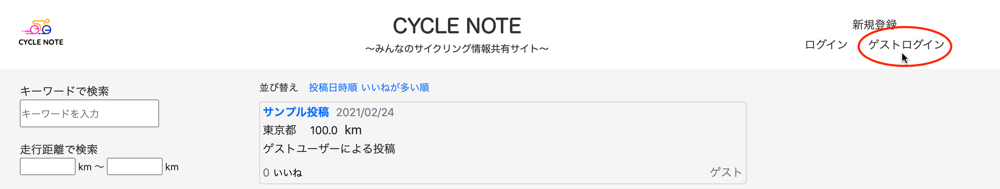
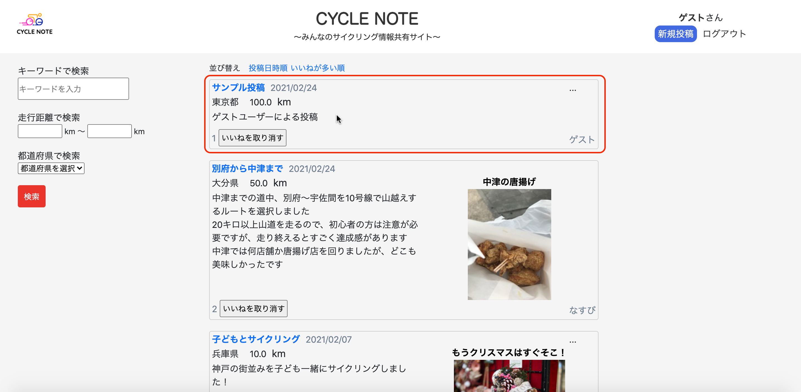
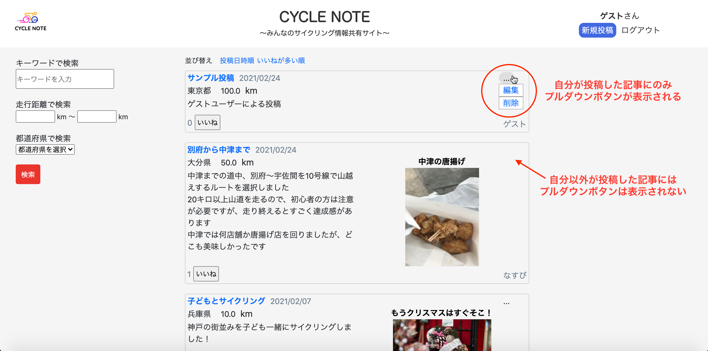

## アプリケーション名
#### CYCLE NOTE

## 開発環境
* フロントエンド：HTML&CSS / JavaScript / Bootstrap<br>
* バックエンド：Ruby / Ruby on Rails<br>
* 単体テスト・結合テスト：RSpec<br>
* インフラ：AWS（EC2 / S3）<br>
* テキストエディタ：Visual Studio Code

## URL
http://18.177.112.110/

## ログイン方法
ヘッダー右側のゲストログインボタンから、挙動確認用にゲストユーザーとしてログインすることができます<br>
ゲストユーザーは、ユーザー情報の編集機能を除き、アプリの全機能を使用することができます<br>
また、アプリユーザーは、新規登録ボタンからユーザー登録することでアプリの全機能を使用することができます<br>


## アプリケーション概要
サイクリングの体験を投稿し、共有できるアプリです<br>
アプリの主要機能は以下の通りです<br>
#### 1. 記事の投稿
ヘッダーの新規投稿ボタンから記事投稿画面に移動します<br>
タイトル、都道府県、走行距離、できごと、画像タイトル(任意)、画像(任意)を入力することで、記事の投稿ができます<br>
  
#### 2. 記事の表示
投稿した記事は、トップページに表示されます<br>

#### 3. いいね機能
投稿された記事に対して、いいねを押すことができます<br>

[]()
#### 4. 記事の検索
投稿された記事を、キーワード・走行距離・都道府県の項目で検索することができます<br>

[]()
#### 5. 記事へのコメント
記事のタイトルまたは画像をクリックして、記事詳細ページに移動して、記事へのコメントを送ることができます<br>
自分が送ったコメントは記事詳細ページに表示されます<br>
  
#### 6. 記事の編集・削除
自分が投稿した記事には、記事の右上にプルダウンボタンが表示されます<br>
このプルダウンボタンをクリックして表示されるメニューから、記事の編集・削除ができます<br>



## 制作背景
* 自分の趣味であるサイクリングに関するアプリを考案しました。<br>
* その背景として、インターネット上で、サイクルスポットに関する情報が、琵琶湖やしまなみ海道などのメジャースポットをまとめた旅行サイトの記事などに限られており、実際の体験談やマイナーなスポットなどの情報が得にくいと感じていました<br>
* その反面、友人の体験談などから、自分も同じスポットに興味を持つことがあり、サイクリングの体験談は、同じ趣味を持つ人に需要があるのではないかと考えました<br>
* 以上の経験から、誰でも気軽にサイクリングの体験を共有しあえるサービスを考案し、本アプリを作成しました<br>

#### 目的のターゲット層
サイクリングが趣味の人

#### どんなニーズ&課題に
・他の人のサイクリングの体験を知りたい<br>
・サイクルスポットの情報が知りたい<br>
・おおよそのサイクリング距離が知りたい

## 実装機能一覧
#### ユーザー管理機能（新規登録・ログイン）/ 記事投稿機能 / 記事一覧表示機能 / マイページ記事一覧表示機能 / 
#### ユーザー登録情報編集機能 / 記事詳細表示機能 / コメント機能 / 記事編集・削除機能 / 画像投稿機能 / 記事検索機能 / 
#### いいね機能 / 記事並び替え機能 / ゲストログイン機能 / ページネーション機能 / レスポンシブデザイン

## DB設計
<br><br><br><br><br><br>&ensp;&ensp;・usersテーブル：ユーザー情報を管理<br>&ensp;&ensp;・articlesテーブル：投稿記事の情報を管理<br>&ensp;&ensp;・commentsテーブル：コメント情報を管理<br>&ensp;&ensp;・likesテーブル：いいね情報を管理<br clear="all">


## 工夫したポイント
* 記事の表示方法に関して、次の2点を工夫しました<br>
1点目は、アプリの特性を踏まえて、走行距離や都道府県といったサイクリングの用途に適した検索フォームを作成しました<br>（アプリケーションの概要4参照）<br>
2点目は、自分が見たい投稿が上位に来るよう、投稿日時順やいいね順での並び替え機能を作成しました（下図）<br>
   <br><br>
* 異なるデバイスの画面幅に対応できるよう、レスポンシブデザインを実装しました（上：PC画面、下：スマホ画面）<br>
 <br>
 &ensp; 

## 今後実装したい機能
* Dockerの導入<br>
* キーワードのタグ付け機能<br>
* ユーザーフォロー機能<br>
* SNSアカウントとの連携<br>
* いいねされた時の通知機能<br>

## ローカルでの動作方法
1. ターミナル上で、作業用のディレクトリに移動し、以下のコマンドを実行してください
```ターミナル
% git clone https://github.com/takuya-karatsu/cycle-app.git
% cd cycle-app
% bundle install
% yarn install 
% rails db:create
% rails db:migrate
```
2. config/environments/development.rbおよびconfig/environments/production.rbの記述を下記のように修正してください
```
# 修正前
# ~前略~
config.active_storage.service = :amazon
```
```
# 修正後
# ~前略~
config.active_storage.service = :local
```
3. 下記コマンドを入力後、http://localhost:3000/ にアクセスしてください
```ターミナル
% rails s
```
