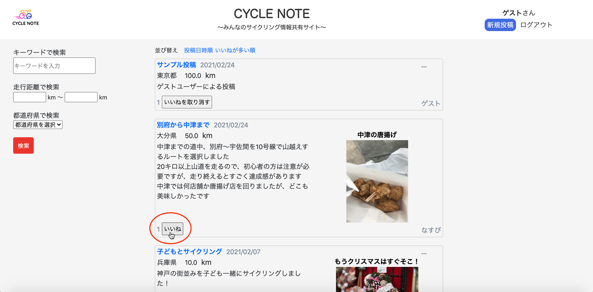

## アプリケーション名
CYCLE NOTE

## アプリケーション概要
サイクルスポットを共有できるアプリ 
アプリ機能は以下の通り 
#### 1. 記事の投稿
タイトル、都道府県、走行距離、できごと、画像タイトル(任意)、画像(任意)を入力することで、記事の投稿が出来る 
  
#### 2. 記事の表示
投稿した記事は、トップページに表示される 

#### 3. いいね機能
投稿された記事に対して、いいねを押すことが出来る 

#### 4. 記事の検索
投稿された記事を、キーワード・走行距離・都道府県の項目で検索出来る 

#### 5. 記事へのコメント
記事詳細ページから記事へのコメントができる 
  

## 開発環境
HTML&CSS / Ruby / Ruby on Rails / JavaScript / Bootstrap / 
EC2 / S3 / Visual Studio Code

## URL
http://18.177.112.110/

## 制作背景
趣味のサイクリングに関して、インターネット上にサイクルスポットの情報が少なかった 
一方、友達からの口コミで目的地を決める経験がしばしばあった 
以上の経験から、誰でも気軽にサイクリングの経験を共有しあえるサービスはないかと考え、本アプリを考案 
#### 目的のターゲット層
サイクリングが趣味の人
#### どんなニーズ&課題に
・他の人のサイクリングの経験を知りたい 
・サイクルスポットの情報が知りたい 
・おおよそのサイクリング距離が知りたい

## ログイン方法
ヘッダー右側のゲストログインボタンから、ゲストユーザーでログイン可能

## 実装機能一覧
#### ユーザー管理機能（新規登録・ログイン）/ 記事投稿機能 / 記事一覧表示機能 / マイページ記事一覧表示機能 / 
#### ユーザー登録情報編集機能 / 記事詳細表示機能 / 記事編集・削除機能 / 画像投稿機能 / 記事検索機能 / いいね機能 / 
#### ゲストログイン機能 / ページネーション機能 / レスポンシブデザイン

## DB設計
### ER図

## 工夫したポイント
・走行距離や都道府県などサイクリングの用途に応じた検索フォームを作成 
・異なるデバイスの画面幅に対応するため、レスポンシブデザインを実装（左図：PC画面、右図：スマホ画面） 
  

## 課題や今後実装したい機能
・ユーザーフォロー機能 
・SNSアカウントとの連携 
・いいねされた時の通知機能 
